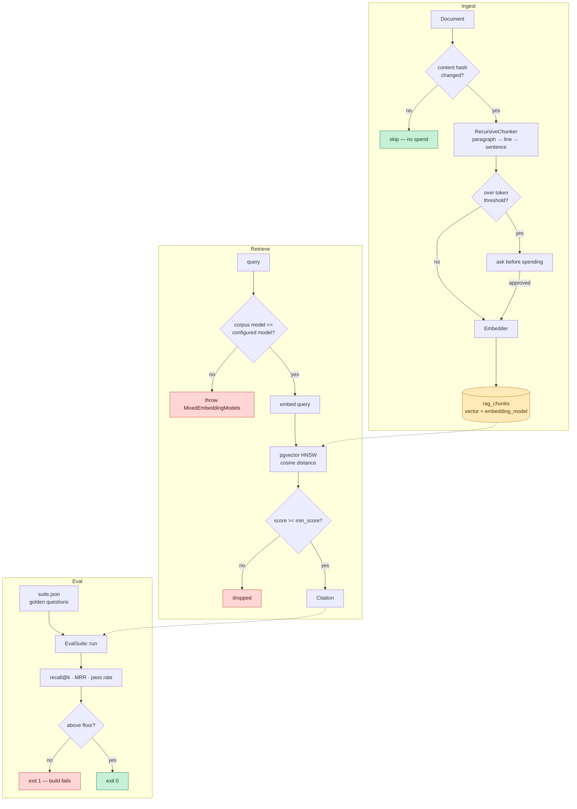

# laravel-rag

**Retrieval-augmented generation for Laravel, with an eval harness that fails your build when retrieval quality drops.**

[](https://github.com/ikramulmustafa/laravel-rag/actions/workflows/ci.yml)
[](https://packagist.org/packages/ikramulmustafa/laravel-rag)
[](LICENSE)
[](https://www.php.net/)
[](https://laravel.com/)

---

## Why this exists

A traditional pipeline that breaks throws an error. Monitoring catches it, someone gets paged, you fix it. The failure is loud.

An LLM pipeline that breaks produces output. Clean, well-formed, plausible output. It just happens to be wrong.

You change the chunk size to fit a longer document. You swap the embedding model because a cheaper one shipped. You add four hundred pages to the corpus and the index dilutes. In every case the system keeps answering, keeps sounding confident, and keeps citing sources — just the wrong ones. No exception is thrown. No alert fires. You find out when a customer does.

So this package treats retrieval quality as something you **test**, the same way you test anything else that can silently break. `php artisan rag:eval` runs a golden set of questions against your corpus, scores recall and MRR, and exits non-zero when either falls below a floor you set. Put it in CI and a retrieval regression fails the build instead of reaching production.

The RAG parts are deliberately unremarkable. The eval loop is the point.

---

## Contents

- [Install](#install) · [Quick start](#quick-start) · [How it works](#how-it-works)
- [The eval harness](#the-eval-harness) · [Wiring it into CI](#wiring-it-into-ci)
- [Design decisions](#design-decisions) · [Commands](#commands) · [Configuration](#configuration)
- [Testing](#testing) · [Limitations](#limitations)
- [CONTRIBUTING](CONTRIBUTING.md) · [CHANGELOG](CHANGELOG.md) · [SECURITY](SECURITY.md)

---

## Install

```bash
composer require ikramulmustafa/laravel-rag
php artisan vendor:publish --tag=rag-config
php artisan migrate
```

Requires **PHP 8.2+** with **Laravel 12**, or **PHP 8.3+** with **Laravel 13**, and **PostgreSQL with [pgvector](https://github.com/pgvector/pgvector)** for production use. The migration creates the extension for you if the role has permission.

Laravel 11 is not supported. Every 11.x release now carries a Packagist security advisory, so Composer blocks it under its default policy and the version cannot be installed or tested at all. Claiming support for something CI cannot verify seemed worse than saying so here.

```env
OPENAI_API_KEY=sk-...
RAG_EMBEDDING_MODEL=text-embedding-3-small
RAG_EMBEDDING_DIMENSIONS=1536
```

---

## Quick start

```php
use Ikram\Rag\Facades\Rag;

Rag::ingest(
    source: 'policies/refunds.md',
    content: file_get_contents(storage_path('policies/refunds.md')),
    collection: 'policies',
);

$result = Rag::retrieve('How long do customers have to request a refund?');

$result->toPrompt();   // numbered context block, ready for a prompt
$result->sources();    // ['policies/refunds.md']
$result->topScore();   // similarity of the best match
```

Or from the command line:

```bash
php artisan rag:ingest storage/policies --collection=policies
php artisan rag:eval
```

### Answering with citations

`retrieve()` never hands back bare context. Every result carries the chunk, the source, the position and the score, so the answer is traceable and a groundedness check has something to verify against.

```php
$result = Rag::retrieve($question, limit: 5);

if ($result->isEmpty()) {
    return 'I do not have information on that.';   // a valid answer
}

$answer = $llm->complete(<<<PROMPT
    Answer using only the context below. If the context does not contain the
    answer, say so. Cite sources by their bracket number.

    {$result->toPrompt()}

    Question: {$question}
    PROMPT);

return ['answer' => $answer, 'citations' => $result->citations];
```

---

## How it works



---

## The eval harness

An eval suite is a JSON file of questions with known-good answer locations:

```json
{
  "refund-window": {
    "query": "How long do customers have to request a refund?",
    "expected_sources": ["policies/refunds.md"],
    "must_contain": ["30 days"]
  },
  "not-in-corpus": {
    "query": "What is the CEO's home address?",
    "expect_no_answer": true
  }
}
```

Every terminal sample below is real output from this repository's own fixture
suite, which you can reproduce after cloning:

```
$ vendor/bin/testbench rag:ingest tests/Fixtures/corpus --force
$ vendor/bin/testbench rag:eval --suite=tests/Fixtures/suite.json --k=4

   INFO  Suite 'suite' — 5 cases at k=4.

+----------------+-------+-------+-------+
| metric         | score | floor |       |
+----------------+-------+-------+-------+
| pass_rate      | 0.800 | 0.900 | BELOW |
| recall_at_k    | 1.000 | 0.800 | pass  |
| mrr            | 1.000 | 0.600 | pass  |
| mean_top_score | 0.311 | —     |       |
+----------------+-------+-------+-------+

   WARN  1 case(s) failed:


  ✗ leave-not-shipping
    query: What is the annual leave accrual rate?
    → retrieved context contains forbidden text: 'PO boxes'
```

That failure is the point of the example. The fixture corpus is three chunks, one
per document, so a window of four returns all of it, and a `must_not_contain`
assertion against a window that holds the whole corpus fails whatever the ranking
is. It tells you nothing about retrieval. A window has to be smaller than the
corpus to measure anything, which is why CI ingests the fixtures in 200-character
chunks (seven of them) and scores them at `k=2`.

### What gets measured

| metric | what it tells you | how it is computed |
|---|---|---|
| `recall_at_k` | Did the right sources appear in the window at all? | Per case, the fraction of `expected_sources` present in the top `k`; averaged across cases. A case naming no expected sources scores 1.0. |
| `mrr` | Did the right source appear *first*? Most prompts only fit a handful of chunks, so rank matters more than presence. | Per case, `1 / rank` of the first returned chunk whose source is expected, or 0.0 if none is; averaged across cases. Rank is counted over returned **chunks**, not documents. |
| `pass_rate` | Fraction of cases with zero violations. | A case passes only with no violations at all, across `expected_sources`, `must_contain`, `must_not_contain` and `expect_no_answer`. |
| `mean_top_score` | Absolute similarity of the best match. Drifting downward across runs usually means corpus dilution. | Mean of the top score per case. A case that retrieved nothing contributes 0.0. |

One asymmetry worth knowing, because it changes how you read a report:
`pass_rate` counts every case, while `recall_at_k`, `mrr` and `mean_top_score`
are averaged over answerable cases only — cases marked `expect_no_answer` are
excluded from all three, since "the rank of the correct source" is meaningless
when correct means *nothing*. A suite of nothing but `expect_no_answer` cases
therefore reports `recall_at_k` of 0.000, and that number means "not
applicable", not "broken".

### Why retrieval and not answer quality

Scoring the model's final answer needs an LLM in the loop, which is slow, costs money per run, and is itself non-deterministic — the exact properties that stop a check from running on every push.

Retrieval is measurable without any of that. It is deterministic, it costs one embedding call per question, and it is where most RAG regressions actually originate. If the right chunk never reaches the prompt, no amount of prompt engineering downstream recovers it.

Answer-level evaluation is worth doing. It belongs in a nightly job, not a pre-merge gate.

### `expect_no_answer` matters more than it looks

The most damaging RAG failure is not a wrong answer to a hard question. It is a confident answer to a question the corpus cannot address. A retriever that always returns `k` results will hand the model irrelevant context, and the model will use it.

A case marked `expect_no_answer: true` fails if the retriever returns anything at
all, and what "anything" means depends entirely on `min_score`: a chunk is kept
when its score is greater than or equal to the floor. At the default `min_score`
of `0.0` nothing is ever dropped, so these cases fail against any non-empty
corpus. That is not a bug to work around, it is the floor telling you it has not
been set yet — add the cases first, look at what scores come back for questions
the corpus cannot answer, and put the floor between those and your real matches.

Include several. They are the only thing that measures whether your system can
say "I don't know."

They are also excluded from `recall_at_k`, `mrr` and `mean_top_score`, and counted
in `pass_rate` — see the note under [What gets measured](#what-gets-measured).

---

## Wiring it into CI

```yaml
- name: Fail the build if retrieval regressed
  run: php artisan rag:eval --ci
```

That is the shape inside an application. This repository gates itself the same
way — see [`.github/workflows/ci.yml`](.github/workflows/ci.yml), where the
`eval` job stands up Postgres with pgvector, ingests `tests/Fixtures/corpus` and
runs the suite against it. Inside a package there is no application to boot, so
those steps call `vendor/bin/testbench` instead of `php artisan`; the commands and
flags are identical.

Floors live in `config/rag.php`:

```php
'thresholds' => [
    'pass_rate'   => 0.90,
    'recall_at_k' => 0.80,
    'mrr'         => 0.60,
],
```

### Comparing against a baseline

Absolute floors answer "is this bad?". Once a corpus is large enough that no absolute number is obviously right, the more useful question is "did this get worse?".

```bash
php artisan rag:eval --save=.rag-baseline.json          # on main
php artisan rag:eval --baseline=.rag-baseline.json --ci # on a PR
```

Here is a real one. The baseline was saved at the default chunk size of 1000; the
comparison run is the same corpus and the same suite re-chunked at 200:

```
   INFO  Against baseline:

  pass_rate        1.000 → 0.800  -0.200
  recall_at_k      1.000 → 1.000  +0.000
  mrr              0.767 → 1.000  +0.233
  mean_top_score   0.531 → 0.550  +0.018

   WARN  1 metric(s) regressed:

  ↓ pass_rate dropped 0.2000 (1.0000 -> 0.8000)
```

That is the entire argument for this package, and it is more interesting than a
row of red numbers would have been. Smaller chunks made ranking strictly better —
`mrr` went from 0.767 to a perfect 1.000, so the right document now comes back
first every time. Judged on the metric most people reach for, the change is an
improvement and you ship it.

It also tightened the chunks enough that a shipping paragraph about PO boxes
started fitting inside the window for a question about annual leave, which is a
`must_not_contain` violation and drops `pass_rate` from 1.000 to 0.800. Every unit
test still passes. Nothing throws. Retrieval got better and worse at the same
time, and only the diff says so.

`--baseline` on its own reports. `--ci` is what makes any of it fail the build,
and with both flags a build fails on a regression as well as on a floor breach.
How far a metric may drop before it counts as a regression is set per metric in
`config/rag.php`:

```php
'tolerances' => [
    'pass_rate'      => 0.0,   // any measurable drop fails
    'recall_at_k'    => 0.0,
    'mrr'            => 0.0,
    'mean_top_score' => 0.02,  // absolute similarity drifts; give it room
],
```

Scores are compared at the four decimal places a saved baseline actually holds,
so a run compared against its own baseline reports no regression rather than a
rounding artefact.

### Eval history

Every `rag:eval` run is also written to `rag_eval_runs` — scores, failure
reasons, the embedding model that produced them, and the commit if one can be
determined from the environment or `.git/HEAD`. `--baseline` compares two points;
the table keeps all of them, which is what you want when a regression surfaces
weeks after the commit that caused it. Pass `--no-record` to skip the write. If
the write fails — a read-only database user in CI, say — it warns on stderr and
the eval still reports and still gates, because recording history is a
convenience and the gate is not.

---

## Design decisions

Four choices here are opinionated. Each solves a failure I would rather not repeat.

### 1 · Every chunk records the model that embedded it

Vectors from different embedding models occupy different spaces. Cosine distance between them is a real number with no meaning — so the query returns results, they rank plausibly, and they are wrong.

Swapping `text-embedding-3-small` for `-3-large` and reindexing only part of a corpus produces exactly this. Nothing errors.

So `embedding_model` is stored on every row, and the retriever refuses to search a corpus whose model does not match the configured one:

```
Ikram\Rag\Exceptions\MixedEmbeddingModels

  Corpus was embedded with "openai:text-embedding-3-small" but the configured
  embedder is "openai:text-embedding-3-large". Searching across models returns
  confident nonsense. Either restore the previous model in config/rag.php, or
  run `php artisan rag:reindex`.
```

The check runs on every `retrieve()` call, before the query is embedded, so it
fails on the first search after a mismatched model swap rather than at some
later point that happens to notice. A hard failure there beats plausible
nonsense in production.

### 2 · Ingestion asks before spending

Embedding cost is invisible until the invoice. Above a configurable token estimate, `rag:ingest` prints what it is about to spend and waits.

Content is also hashed. Re-ingesting a nightly export of 10,000 documents where nine changed costs nine documents, not ten thousand.

### 3 · Retrieval always carries citations

There is no API for "just give me the context string." `RetrievalResult` holds the chunk, source, position and score together, because an answer you cannot trace is precisely what makes these failures invisible.

### 4 · Returning nothing is a valid answer

`min_score` drops weak matches rather than padding the prompt to reach `k`. Combined with `expect_no_answer` cases in the suite, this is what stops the system inventing answers from irrelevant context.

---

## Commands

| command | purpose |
|---|---|
| `rag:ingest {path}` | Chunk, embed and store a file or directory |
| `rag:eval` | Run the suite; `--ci` exits non-zero below threshold |
| `rag:reindex` | Re-embed everything with the current model |

<details>
<summary><strong>Full options</strong></summary>

```bash
# Ingest
rag:ingest storage/docs --collection=policies
rag:ingest storage/docs --pattern='*.mdx'   # glob when path is a directory; default *.md
rag:ingest storage/docs --force             # skip the spend prompt

# Eval
rag:eval --suite=tests/rag/suite.json
rag:eval --k=10                             # widen the retrieval window
rag:eval --json                             # machine-readable on stdout, nothing else
rag:eval --ci                               # exit 1 on a floor breach or a regression
rag:eval --save=baseline.json               # write this run, for use as a future baseline
rag:eval --baseline=baseline.json           # compare against a saved run
rag:eval --no-record                        # skip the write to rag_eval_runs

# Reindex
rag:reindex --collection=policies
rag:reindex --force
```

Directory ingestion records sources with forward slashes on every platform, so a
suite committed on Linux still matches a corpus ingested on Windows.

</details>

---

## Configuration

Every setting is documented inline in `config/rag.php`. The two worth knowing:

**`chunking.size` and `chunking.overlap`** — do not tune these by intuition.
Change one, run `rag:reindex`, run `rag:eval`, and keep the change only if the
scores improve. That loop is why the harness ships with the package.

The `rag:reindex` step is not optional and it is the easy one to miss. Ingestion
skips documents whose content hash is unchanged, and a chunking change does not
change any document's content — so `rag:ingest` after a chunk-size edit reports
everything as unchanged and skipped, leaves the old chunks in place, and the eval
that follows scores the configuration you were trying to replace. `rag:reindex`
clears the hashes and rebuilds, which is what actually applies the change.

**`retrieval.min_score`** — starts at `0.0` (disabled). Raise it once your suite contains `expect_no_answer` cases, since those are what tell you where the floor belongs.

---

## Testing

```bash
composer test      # pest
composer lint      # pint --test
composer analyse   # phpstan level 6
```

The suite runs against **SQLite in memory with a deterministic hash-based
embedder** — no network, no API key, no Postgres. Retrieval tests assert real
ranking rather than mocked returns, because `FakeEmbedder` places texts sharing
vocabulary genuinely near each other.

That matters more than it sounds. An offline suite runs on every push. A suite
needing an API key runs nightly, if at all.

CI additionally runs the eval job against real Postgres with pgvector, so the ANN
path and the in-PHP fallback are both exercised. On the fixture suite the two
agree exactly — `pass_rate` 1.000, `recall_at_k` 1.000, `mrr` 0.767,
`mean_top_score` 0.531 from both the `<=>` cosine operator over an HNSW index and
the PHP implementation. That agreement is the point of running both: it is what
tells you the portable fallback is a fallback and not a second, subtly different
retriever.

There is also `tests/verify-standalone.php`, which covers chunking, the fake
embedder, cosine similarity, pgvector literal formatting and the full eval
scoring path on bare PHP with no Composer dependencies at all:

```bash
php tests/verify-standalone.php
```

It exists because a test suite you cannot run when the network is down is a test
suite you do not run.

---

## Limitations

Worth knowing before you adopt this.

**Postgres or nothing, in production.** SQLite and MySQL work, but fall back to computing cosine similarity in PHP, which loads every candidate row into memory. Fine for tests and small corpora. Not fine at scale.

**No reranking.** Single-stage vector retrieval only. A cross-encoder reranker would improve precision at `k`; it is not here yet.

**No hybrid search.** Dense vectors only, no BM25 blending. Exact keyword matches — product codes, names, identifiers — are where pure vector search is weakest.

**Embedding drivers.** OpenAI plus the fake. Implementing `Embedder` is four methods if you need another.

**`FakeEmbedder` is not semantic.** It is hash-based bag-of-words. It preserves
enough ordering to test retrieval logic. It is not a small language model, and
the retriever will refuse to mix its vectors with real ones.

Its collisions are real, and worth knowing if you write tests against it. Tokens
are hashed into a fixed number of buckets, and at the 64 dimensions the suite
uses, `md5('refund')` and `md5('shipping')` land in the same one — so a
single-token query is settled by that collision rather than by relevance.
Multi-word queries carry enough signal to rank correctly, which is what the
retrieval tests use. Assert on ranking with realistic queries, not single words.

---

## Contributing

Issues and pull requests welcome. See [CONTRIBUTING.md](CONTRIBUTING.md) for
setup and the checks CI runs.

The short version: run `composer test`, `composer lint`, `composer analyse` and
`composer verify` before opening a pull request. If you change anything touching
retrieval — chunking, scoring, filtering, the query path — include the
before-and-after `rag:eval` output in the description. That is the standard this
package asks of its users, so it should hold itself to it.

Released versions are listed in [CHANGELOG.md](CHANGELOG.md). Security reports go
through [SECURITY.md](SECURITY.md), not the public issue tracker.

---

## License

MIT — see [LICENSE](LICENSE).

---

Built by [Ikram UL Mustafa](https://ikramulmustafa.com) — I build RAG and agent systems on Laravel. Notes on the engineering behind this package are at [ikramulmustafa.com](https://ikramulmustafa.com).
